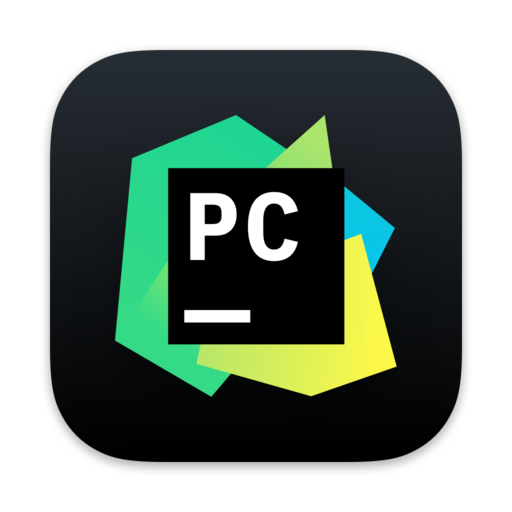
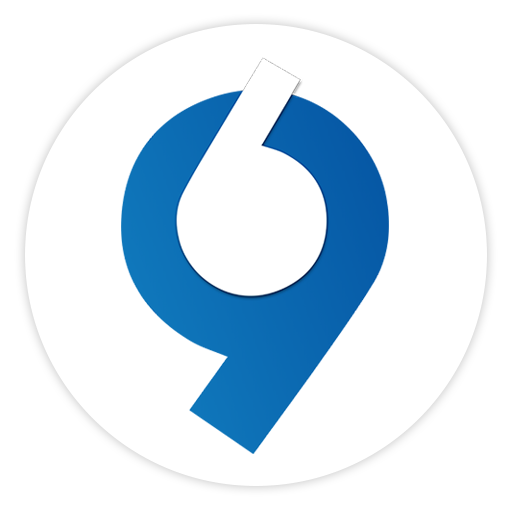

<h1 align='center'><i><samp> Hello 😃 , I'm <a href='https://zil.ink/ehsanamirahmadi/'>Ehsan Amirahmadi</a>!</samp></i></h1>
<h5 align='center'><h5>
<h4><b> I'm Ehsan from Iran, and i'm a python developer 🙃 </b></h4>

- 🌱 <b><samp>I’m currently learning Python</samp></b>
- 😄 <b><samp>Pronouns: He/Him</samp></b> 

%2015%20-265ebf?style=flat)

  <!--  -->
  
<!--   -->
##
  
### Skills and Tools ✔

<!-- django-docker-linux-mongodb-vim-postgres-qt -->

### <a href='https://zil.ink/ehsanamirahmadi/'>My links and Connectinos</a> 🔗

<a href='https://zil.ink/ehsanamirahmadi/'>-405BBD?style=style=flat&logo=&logoColor=white)</a>
<a href='https://virgool.io/@ehsanamirahmadi1385/'>-0D173B?style=flat&logo=&logoColor=white)</a>

<!--   -->

## Analysis 📊 
<!--    -->
  

  <a href="https://github.com/EhsanAmirahmadi">
  
   
   
  
  </a>

  
  
  <!-- 

 -->
 
<!--    -->

<!-- ### My favorites ❤️

 -->

<!--   -->
  
  
  <!--     -->
<!--    -->
  
<!-- 

  
 
 
  
  
 -->
  

<!-- 

  
  
  
  
  
  
  

 -->
<!-- 
 

 

   -->
<!-- 
 
 

   -->
<!--  -->
 
